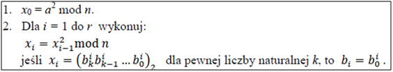
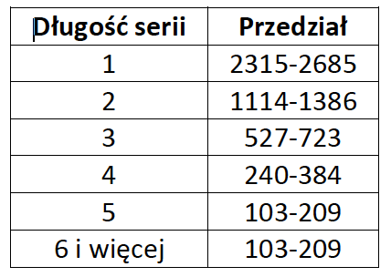
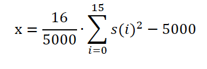
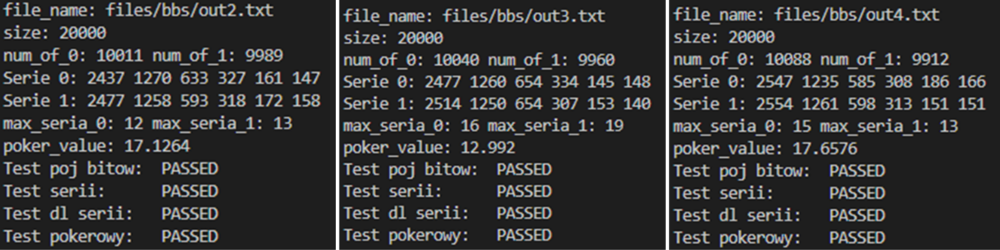

# Generator liczb pseudolosowych BBS wraz z szyfratorem strumieniowym
## Generator liczb pseudolosowych BBS
BBS jest generatorem liczb pseudolosowych. Jego głównym atutem jest prostota implementacji i co się później okaże – względnie dobra imitacja losowości. Atrybutami wejściowymi są kolejno: liczba Bluma, długość ciągu, oraz losowa liczba naturalna <i>a</i>, będąca względnie pierwszą z wcześniej wymienioną liczbą Bluma. Liczba <i>a</i> musi być mniejsza od liczby Bluma. Na wyjściu otrzymujemy ciąg pseudolosowy. Algorytm BBS umożliwia bezpośredni dostęp do dowolnego bitu ciągu, gdy zna się rozkład liczby Bluma. Liczba ta jest iloczynem dwóch liczb pierwszych <i>p</i> i <i>q</i> takich, że {p, q}%4 = 3. Moc algorytmu jest silnie uzależniona od zastosowanych liczb <i>p</i> i <i>q</i>. Przy niewystarczająco dużych występować może cykl, który psuje wrażenie losowości.

Przy implementacji wykorzystany został specyficzny sposób podnoszenia liczby do kwadratu. W celu uniknięcia przepełnienia limitu zmiennej, mnożenie wykonywane jest w pętli, a co każde wykonanie tejże pętli wykonywana jest operacja modulo. Dzięki temu rozwiązaniu uniemożliwia się przepełnienie wartości zmiennej.

Zaimplementowany algorytm pozwala na reprezentację bitów w dwóch wersjach. Pierwszą jest fizyczna implementacja bitów, z których tworzone są bajty, a w konsekwencji znaki. Znaki te są następnie przekazywane do pliku. Drugi tryb jest nieco bardziej przyjazny dla użytkownika, przenosząc do pliku jedynie logiczną reprezentację bitów w postaci ciągu zer i jedynek (odpowiednio znaku 48 i 49 decymalnie).

   

 

---
## Szyfrator strumieniowy
W programie zaimplementowany został szyfrator strumieniowy z wykorzystaniem generatora BBS. Do generowania klucza zastosowana została metoda opisana w pierwszym punkcie z wykorzystaniem znaków stworzonych z losowy wygenerowanych bitów. Na postawie klucza oraz tekstu do zaszyfrowania generowany jest szyfr z wykorzystaniem operacji XOR. Długość klucza nie może być mniejsza od długości tekstu jawnego. W celu odszyfrowania wiadomości należy użyć tej samej funkcji, oraz tego samego klucza co przy szyfrowaniu. Operacja XOR zapewnia nam tą własność, dzięki czemu nie trzeba tworzyć osobnej funkcji.

---
## Testy
W programie zaimplementowane zostały również proste testy sprawdzające algorytm. Testy zostały zaimplementowane w oparciu o pliki tekste zawierające logiczną reprezentację bitów (ciąg zer i jedynek). Wykorzystane pliki posiadają 20 000 bitów wygenerowanych przez zaimplementowany algorytm BBS. Full_test() składa się z 4 testów statystycznych według FIPS 140-2:
* test pojedynczych bitów – zliczana jest ilość wystąpień liczby pojedynczych bitów, ilość zer oraz jedynek powinna mieścić się w przedziale (9725; 10275).
* test serii – seria w danym ciągu to maksymalny podciąg następujących po sobie zer lub jedynek. Wartości powinny mieścić się w poniższych przedziałach:

   

 

* test długiej serii – w tym teście brana jest najdłuższa seria wystąpień danego rodzaju bitu po sobie. Ilość ta nie powinna przekroczyć wartości 26.
* tekst pokerowy – ciąg dzielony jest na mniejsze fragmenty po 4 bity. Fragmenty te są konwertowane na liczby heksadecymalne. Następnie obliczana jest wartość X według poniższego wzoru. Test kończy się sukcesem, gdy X jest w przedziale (2.16; 46.17).

   

 

---
### Przykładowe wyniki

   

 

---
### Źródła
https://www.geeksforgeeks.org/multiply-large-integers-under-large-modulo/
