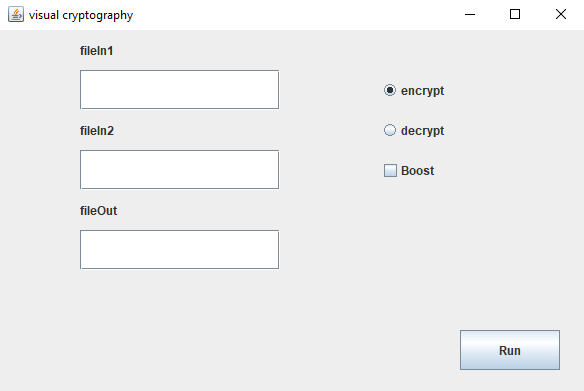
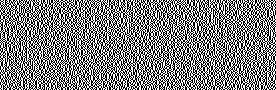
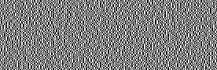
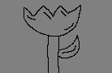
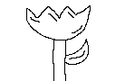

# Kryptopgrafia wizualnia
## Wstęp
Kryptopgrafia wizualnia - polega na ukrywaniu wiadomości w obrazach. Każdy cyfrowy obraz składa się z określonej ilości pikseli. Można podzielić pojedynczy piksel na tzw. `subpiksele`. Tak podzielone piksele można rozdzielić na conajmniej dwa różne obrazki. W ten sposób pozornie nieczytalne wiadomości na pierwszy rzut oka nałożone na siebie odkrywają oryginalny obraz. Po nałożniu na siebie obrazków (gdzie używane są tylko piksele czarne i białe) w efekcie piksele czarne nie zmieniają koloru, a białe zamieniają się w szare. Wynika to z szumu który dostaje się w wyniku nałożenia białego subpiksela na czarny subpiksel. Możliwa jest też wersja odwrotna (wszystko zależy czy kolor czarny jest określany jako minimalna wartość, czy też maksymalna). Przez zastosowanią funcję losującą udziały wydają się losowym zbitkiem pikseli, bez żadnego wzoru.

## Opis aplikacji
Aplikacja została wykonana w języku programowania `Java`. Do zaprojektowania i wykonania interfejsu graficznego wykorzystano bibliotekę `swing`.

  

    

Aplikacja pozwala na proste rozbicie pliku graficznego na `2 osobnie udziały`. Wykorzystywane są `2 subpiksele` w konsekwencji pojedynczy udział jest 2x szerszy. Obsługiwane są jedynie pliki `bmp`.

W celu rozdzielenia obrazu na 2 udziały należy uzupełnić pole `fileIn1` nazwą pliku (bez rozszerzenia) oraz nazwą pliku wyjściowego w polu `fileOut`. Zaznaczony musi być również `radio encrypt`. Tworzone są dwa pliki o nazwie umieszczonej w pole `fileOut` kolejno z końcówkami `1` oraz `2`.

W celu nałożenia na siebie dwóch obrazów uzupełnić wszystkie pola typu `textInput` o nazwy plików, oraz wybrać opcję `radio decrypt`. Zaimplementowana została dodatkowa opcja `boost` pozwalająca na odszumienie obrazu z szarych pikseli. Zapewniona została podstawowa obsługa błędów. Nie jest możliwe połączenie ze sobą dwóch obrazów o różnych wielkościach.

Pliki wejściowe znajdują się w katalogu `files/source/`. Wynik operacji rozdzielania na udziały można zaobserwować w katalogu `files/encrypted/`, a operacji łączenia w katalogu `files/decrypted/`.

___

## Prezentacja

  

    

    
    

    
    

