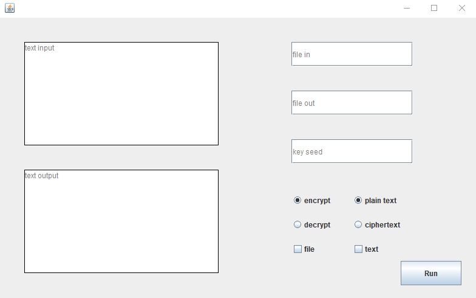

# Steganografia

## Wstęp
Steganografia jest nauką o komunikacji w taki sposób, aby obecność komunikatu nie mogła zostawć wykryta. W odróżnieniu od kryptografii, gdzie fakt wystąpienia komunikatu jest jawne, ukryta jest natomiast treść. Zaimplementowana aplikacja zajmuje się ukrywaniem wiadomości (w sposób jawny, bądź szyfrowany) w plikach graficznych. Zaimplementowany został algorytm który zapisuje informacje na ostatnim, najmniej znaczącym bicie obrazu. Wykorzystywany jest tu fakt, iż kolor piksela jest wartością z przedziału (0; 255) na każdy kanał. Inna wartości na najmniej znaczącym bicie wprowadza zmiane, której człowiek nie jest w stanie zauważyć gołym okiem. Takie ukrywanie wiadomości sprawia, iż wielkość obrazu musi być o 8 razy większa od wielkości wiadomości (`char` ma 8 bitów, zatem należy go zapisać na ośmiu kolejnych bajtach obrazka). W obecnej wersji program pozwala na ukrywanie / czytanie wiadomości z plików z rozszerzeniem `bmp`.

---
## Opis aplikacji
Aplikacja została zaimplementowana przy użyciu języka programowania `Java`. Do stworzenia graficznego interfesju wykorzystana została biblioteka `swing`.

    

Aplikacja pozwala na zapis wiadomości szyfrowanej. Do szyfrowania tekstu wykorzystuje się odpowiedni `seed`. Na podstawie podanego ziarna, za pomocą predefiniowanej funckji `Random()` generowany jest ciąg pseudolosowych bitów o określonej długości. Następnie wykonywana jest operacja `xor` na wiadomości i otrzymanym ciągu. Taki wynik zapisywany jest w obrazie.

Wynik poszczególnych operacji umieszczony może zostać w odpowiednim pliku i/lub na ekranie `text output`. Decyzja jest podejmowana na podstawie checkbox'ów `file`, oraz `text`.

---
### Zaimplementowano kilka trybów w których działa aplikacja:
* Szyfrowanie z użyciem tekstu jawnego - `encrypt` & `plain text` - opcja pozwala na ukrycie tekstu jawnego w obrazie. Wykorzystywane pola:
    * `text input` - zaznaczony checkbox `file` sprawia, że pole staje się nazwą pliku z którego pobrany zostanie tekst. Chceckbox `text` sprawi, że pole to zawiera tekst jawny do ukrycia. Przy znaczeniu obu, priorytet ma checkbox `file`.
    * `file in` - obraz wejściowy, w którym ukryta będzie wiadomość.
    * `file out` - nazwa obrazu po ukryciu wiadomości.

* Deszyfrowanie z użyciem tekstu jawnego - `decrypt` & `plain text` - opcja pozwala na odczytanie tekstu jawnego z obrazu. Wykorzystywane pola:
    * `file in` - obraz wejściowy, w którym ukryta jest wiadomość do odczytania.
    * `file out` - (tylko gdy zaznazony jest checkbox `file`) - nazwa pliku, gdzie zostanie zapisany odczytany tekst.
    * `text output` - (tylko gdy zaznazony jest checkbox `text`) - treść odczytanego tesktu pojawi się w tym polu.

* Szyfrowanie z użyciem tekstu zaszyfrowanego - `encrypt` & `ciphertext` - opcja pozwala na szyfrowanie tekstu i ukrycie szyfrogramy w obrazie. Wykorzystywane pola:
    * `text input` - działanie podobne do tego znanego z `plan text`.
    * `file in` - obraz wejściowy, w którym ukryty będzie szyfrogram.
    * `file out` - nazwa obrazu po ukryciu zaszyfrowanej wiadomości.
    * `seed` - wartość, która służy jako ziarno w algorytmie generującym ciąg losowych bitów.

* Deszyfrowanie z użyciem tekstu zaszyfrowanego - `decrypt` & `ciphertext` - opcja pozwala na odczytanie szyfrogramu z obrazu i deszyfracje z użyciem danego ziarna. Wykorzystywane pola:
    * `file in` - obraz wejściowy, w którym ukryta jest wiadomość do deszyfrowania.
    * `file out` - (tylko gdy zaznazony jest checkbox `file`) - nazwa pliku, gdzie zostanie zapisany odczytany tekst.
    * `text output` - (tylko gdy zaznazony jest checkbox `text`) - treść odczytanego tesktu pojawi się w tym polu.
    * `seed` - wartość, która służy jako ziarno w algorytmie generującym ciąg losowych bitów.
